```mermaid
sequenceDiagram
    Cliente->>+Servidor: POST /clientdata/
    Servidor-->>-Cliente: 8743b520... (hash)
    Cliente->>+Servidor: GET /clientdata/8743b520.../rows
    Servidor-->>-Cliente: 10 (número de filas)
    Cliente->>+Servidor: GET /clientdata/8743b520.../2
    Servidor-->>-Cliente: ["", "d23s", "1-234-567"]
```

# Cofre Sagrado Virtual

Presentación de la defensa del proyecto de Infraestructura Virtual

<div class="absolute bottom-10">
  <span class="font-700">
    Pablo Luque Salguero
  </span>
</div>

<!--
-->

---
hideInToc: true
---

# Contenido

<Toc />

---
layout: section
---

# Objetivo 0
Planteamiento del problema

---
layout: image-right
image: /street_map.png
hideInToc: true
transition: slide-up
---
# Primera aproximación al problema

- Crear una herramienta para ayudar a empresas a encontrar el mejor lugar donde establecer sus negocios

**Rechazada 👎**

<!--
La herramienta utilizaría datos demográficos y económicos de los municipios para calcular la mejor ubicación.
Problemas: falta de datos, necesidad de usar la api de google maps, scope demasiado grande.
-->

---
layout: image-right
image: /csvfile.png
hideInToc: true
---

# Segunda aproximación al problema

- Herramienta de validación y normalización de datos para ficheros CSV

  - Problema con conocimiento personal ✅
  - La solución requiere una cierta lógica de negocio ✅

**Aceptada 👍**

---
layout: section
---

# Objetivo 1
Historias de usuario y milestones


---
hideInToc: true
layout: two-cols-fallen
---

# Una lógica de negocio compleja

::left::
## Trivial ❌
Comprobar que no hay campos vacíos

::right::
## No trivial ✔️
Detectar errores de escritura según el tipo de dato y mostrar sugerencias de corrección

<!--
Para superar este objetivo es necesario crear historias de usuario que requieran cierta cantidad de procesamiento.
En un principio, una de mis historias de usuario solo requería la comprobación de que no existía un campo vacío en un fichero CSV.
-->

---
layout: section
---

# Objetivo 2
Asistente de rutas para camioneros - Carlos Servillera

---
hideInToc: true
---

# El problema de las rutas

- ¿Cómo puedo conocer la distancia y el tiempo que tardaré en llegar a mi destino?

<br/>
<br/>

<div class="flex justify-center">

</div>

---
hideInToc: true
layout: two-cols-fallen
---

# Solución propuesta

::left::


::right::

```go {all|5,6}{at:0}
type Route struct {
	id             string
	arrivalTime    time.Time
	restAreas      []RestArea
	routeDistances [][]int16
	routeTimes     [][]time.Duration
}
```

---
layout: section
---

# Objetivo 3
Automatizando las tareas


<!--
Para el gestor de dependencias la elección estaba clara, desde la introducción de los módulos en Go 1.11,
se ha convertido en el gestor de facto.
-->

---
hideInToc: true
---

# Gestor de tareas
## Opción elegida: [Goyek](https://github.com/goyek/goyek)

<br/>
<br/>

- <logos-microsoft-windows-icon/> Independiente del SO
- <material-symbols-install-desktop/> No requiere instalación
- <logos-go/> Como dependencias la librería estándar de Go

---
layout: section
---

# Objetivo 4
Implementando la lógica de negocio

---
hideInToc: true
transition: slide-up
---

# Primera parte: inferencia de tipos

- Representación de un tipo de dato
```go
type DataType struct {
	KeyRegex  regexp.Regexp
	TypeRegex regexp.Regexp
}
```

- Diccionario para almacenar todos los tipos de datos
```go
var knownDataTypes = map[string]DataType{
  "name": {*regexp.MustCompile(`(?i)(.*name.*|.*nombre.*)`),
  *regexp.MustCompile(...)},
  ...
}
```

---
hideInToc: true
---

```go {all|5-13|14-16}
func inferTypes(values []string) []string {
	types := []string{}
	for _, value := range values {
		found := false
		for key, element := range knownDataTypes {
			// Matches only to the first known dataType
			// If no match found, then it is unknown
			if element.KeyRegex.MatchString(value) {
				types = append(types, key)
				found = true
				break
			}
		}
		if !found {
			types = append(types, "unknown")
		}
	}
	return types
}
```

---
hideInToc: true
---

# Segunda parte: validar los datos

```go {all|8,9|10-15}
func (c *ClientFile) ValidateFileContent() *[][]string {
	for _, records := range c.fileContent {
    ...
		for i, value := range records {
			var nonMatches string
			var err error
			pattern := c.fileTypes.types[i]
      // Get the part of the string that matches
			matches := pattern.FindStringSubmatch(value)
			if len(matches) == 0 {
        // Not a single part of the string matches
				nonMatches = value
			} else if value != matches[0] {
        // If some part matches, get the part that does not
				nonMatches, err = getNonMatchingPattern(value, matches[0])
				if err != nil {
					log.Println(err)
				}
			}
		}
	}
}
```

---
hideInToc: true
layout: fact
---

# Jaro-Winkler

Algoritmo de sugerencias

<!--
Es una extensión del algoritmo de distancia de Jaro.
El algoritmo de Jaro-Winkler tiene en cuenta el prefijo de dos cadenas y asigna una puntuación más alta si las cadenas comparten un prefijo común.
-->

---
hideInToc: true
layout: quote
---

# *"A little copying is better than a little dependency"*
\- [Proverbios de Go](https://go-proverbs.github.io)

---
layout: section
---

# Objetivo 5

Contenedorizando la aplicación

---
hideInToc: true
---

# Criterios de elección de la imagen

<br/>
<br/>

- <material-symbols-memory/> Huella de memoria pequeña
- <material-symbols-security/> Seguridad
- <material-symbols-support-agent/> Buen soporte

---
hideInToc: true
layout: quote
---

# El problema con Alpine Linux

---
hideInToc: true
---

# Solución: multi-stage build

```docker
FROM golang:latest AS build

FROM debian:stable-slim AS final

# Multi-stage build to copy golang toolchain
COPY --from=golang:latest /usr/local/go/ /usr/local/go/
ENV PATH="/usr/local/go/bin:${PATH}"
# Copy certificates
COPY --from=build /etc/ssl/certs/ca-certificates.crt /etc/ssl/certs/
```

---
layout: section
---

# Objetivo 6
Eligiendo herramientas de CI

---
hideInToc: true
layout: quote
---

# <logos-github-actions/> Github Actions
# <logos-appveyor/> AppVeyor

---
layout: section
---

# Objetivo 7
Logs y configuración

---
hideInToc: true
---

# Módulo para la configuración: [Koanf](https://github.com/knadh/koanf)

- Providers
- Parsers

```go{all|3-6|8-12|14-18}
k := koanf.New(".")

// Load configuration from .env file
if err := k.Load(file.Provider(projectpath.Root+"/.env"), dotenv.Parser()); err != nil {
	return nil, fmt.Errorf("failed to load configuration from .env file: %w", err)
}

// Load configuration from environment variables. The keys must be prefixed with CSV_ and
// use _ as the separator
k.Load(env.Provider("CSV_", ".", func(s string) string {
  return strings.ToLower(strings.TrimPrefix(s, "CSV_"))
}), nil)

// Extract configuration from koanf and save into Config struct
config := &Config{}
if err := k.Unmarshal("", config); err != nil {
  return nil, fmt.Errorf("failed to unmarshal configuration: %w", err)
}
```

---
hideInToc: true
layout: quote
---

# Logger: [Zerolog](https://github.com/rs/zerolog)

---
layout: section
---

# Objetivos 8 y 9
Diseñando e implementando la API Rest

---
hideInToc: true
---

# Vuelven a aparecer los proverbios de Go

```go{all|3-7|9-21}
import "net/http"

var (
	postDataRe    = regexp.MustCompile(`^/clientdata/$`)
	getDataRowsRe = regexp.MustCompile(`^/clientdata/([a-z0-9]+)/rows$`)
	getDataRowRe  = regexp.MustCompile(`^/clientdata/([a-z0-9]+)/([0-9]+)$`)
)

func (c *ClientData) ServeHTTP(rw http.ResponseWriter, h *http.Request) {
	switch {
	case h.Method == http.MethodPost && postDataRe.MatchString(h.URL.Path):
		// define logic for POST /clientdata/
		return
	case h.Method == http.MethodGet && getDataRowsRe.MatchString(h.URL.Path):
		// define logic for GET /clientdata/hash/rows
		return
	case h.Method == http.MethodGet && getDataRowRe.MatchString(h.URL.Path):
		// define logic for GET /clientdata/hash/row
		return
	}
}
```
---
hideInToc: true
---



---
hideInToc: true
layout: fact
---

# Gracias por su atención

